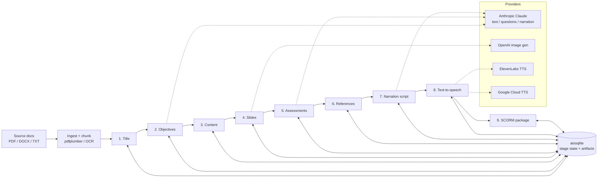

# AI Course-Authoring Platform — Case Study

*A FastAPI backend that turns source material into a complete e-learning course through a
nine-stage, grounded AI pipeline — objectives, slides, assessments, narration, audio, and a
SCORM package — orchestrating multiple model providers behind one async API.*

> Source is private. This write-up covers architecture and engineering decisions, not the
> implementation. Source available on request under NDA or via a live walkthrough.

---

## Problem & context
Producing a single professional training course is slow and expensive: a subject-matter expert
writes objectives, a designer builds slides, someone writes assessment items, a narrator records
audio, and an LMS specialist packages it for delivery. Each hand-off loses context, and the
assessment questions are the riskiest part — a hallucinated or unsupported question can fail an
accreditation review.

The goal was a pipeline that takes ingested source documents and produces a coherent, ready-to-ship
course, where every generated artifact is **grounded in the source** and a human can review and
re-run any single stage without redoing the whole course.

## My role & scope
Sole architect and engineer. I designed the stage model and the data contracts between stages,
built the async FastAPI service and persistence layer, integrated the model providers, and designed
the grounding/anti-hallucination strategy that the assessment and narration stages depend on.

## Architecture

**Data flow:** each stage reads the prior stage's persisted output, calls the right provider, and
writes a validated artifact back to the store. Because every stage is independent and idempotent,
the editor can accept stage 4 but re-run stage 5 against new instructions without touching the rest.

## AI / ML approach
- **Provider per job, not one model for everything.** Claude drives the language-heavy stages
  (content, assessment items, narration script); an image model handles slide visuals; ElevenLabs
  and Google Cloud TTS handle voice. Each stage picks the tool that's actually best for it.
- **Grounding over fluency.** The assessment and content stages run at low temperature and are
  constrained to the ingested source chunks rather than the model's open-domain knowledge — every
  question is tied back to a source excerpt so a reviewer can verify it. This is the same
  anti-hallucination posture used in the standalone [exam generator](./grounded-exam-generator.md).
- **Human-in-the-loop by design.** The stage boundaries *are* the review points. A failed or weak
  stage is re-run in isolation, so the model is never trusted to produce a whole course unattended.

## Key decisions & tradeoffs
- **Nine explicit stages instead of one mega-prompt.** A single prompt that emits a whole course is
  impressive in a demo and unfixable in practice. Discrete stages give per-stage retries, cheaper
  iteration (re-run only what changed), and a clean place to insert review and grounding.
- **Async FastAPI + aiosqlite.** Generation stages are I/O-bound on provider latency; an async
  service keeps long-running stages from blocking each other, and SQLite keeps the deployment
  footprint small while still giving durable per-stage state.
- **Stage contracts as the integration seam.** Each stage consumes and produces a typed artifact, so
  a provider can be swapped (e.g. a different TTS engine) without touching the stages around it.
- **Config-driven keys, nothing hardcoded.** Provider credentials load from the environment with an
  `.env.example` template, so the repo carries no secrets.

## Security & data handling
- All provider API keys load from environment variables; the repo ships an `.env.example` with
  placeholders and no real credentials in source or history.
- Source documents and generated artifacts live in the local store, not in the codebase.
- Inputs are parsed and validated before they reach a provider; OCR is a fallback path for
  image-only PDFs rather than a trusted source of truth.

## Performance, cost & reliability
- **Per-stage retries and isolation** mean a transient provider error costs one stage, not a whole
  course re-run — the dominant cost lever in a multi-provider pipeline.
- **Low-temperature, source-constrained prompts** on the expensive language stages keep output
  deterministic enough to cache and review, and reduce wasted regenerations.
- **Right-sized models per stage** (fast/cheap where quality allows, stronger models where it
  matters) keeps token cost proportional to the value of each stage.

## Outcomes
- A working end-to-end pipeline that takes source material to a packaged, LMS-ready course across
  nine independently re-runnable stages, integrating four model providers behind one async API.
- The grounding strategy makes the assessment stage reviewable rather than a black box — the
  property that matters most for training that has to stand up to scrutiny.

*(This is a personal R&D platform; the figures here describe the build and its design, not a
published production deployment.)*

## What I'd do next
- Add an evaluation harness that scores generated questions against their source excerpts
  automatically, so grounding is measured per run rather than spot-checked.
- Add a job queue and worker model so multiple courses can build concurrently under provider rate
  limits, with backpressure instead of failures.
- Sentry + structured run logs for per-stage observability before any GA use.

---
*Architecture and decisions shown here; source is private. Available for a live walkthrough or under
NDA.*
