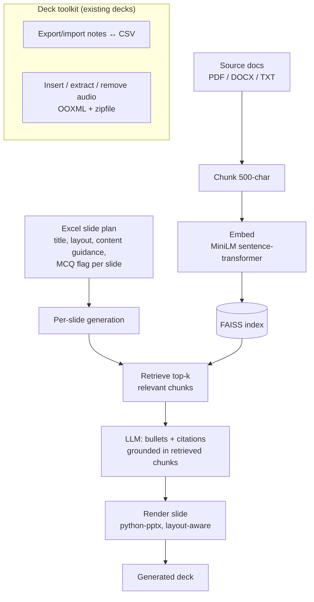

# AI PowerPoint Generator & Deck Toolkit — Case Study

*A desktop tool that builds slide decks from a structured plan and source documents, using
retrieval (embeddings + FAISS) to ground each slide's content and attach citations — plus a
low-level toolkit for surgically editing notes and audio inside existing decks.*

> Source is private. This write-up covers architecture and engineering decisions, not the
> implementation. Source available on request under NDA or via a live walkthrough.

---

## Problem & context
Generating slides with an LLM is easy to demo and hard to trust: the model invents content that
isn't in your material, and you can't tell which source a bullet came from. Separately, working with
*existing* decks at scale — bulk-editing speaker notes, inserting or stripping audio across dozens of
slides — is fiddly because PowerPoint's audio lives in raw OOXML the high-level libraries don't fully
expose.

The goal was two complementary capabilities: (1) generate decks whose content is **retrieved from
and cited to** your own documents, and (2) a reliable toolkit for the low-level note/audio surgery
the high-level APIs can't do cleanly.

## My role & scope
Sole engineer. I built the retrieval-grounded generation path (planning, RAG, slide rendering) and
the OOXML-level deck manipulation toolkit.

## Architecture

**Data flow:** a slide plan defines structure; source documents are chunked, embedded, and indexed;
each slide retrieves its most relevant chunks, generates grounded bullets with citations, and renders
through a layout-aware PowerPoint writer. A separate toolkit operates on existing decks at the OOXML
level.

## AI / ML approach
- **Retrieval-grounded generation (RAG).** Source documents are chunked and embedded with a
  sentence-transformer (`all-MiniLM-L6-v2`) into a FAISS index; each slide retrieves its top-k
  relevant chunks and the LLM is asked to write bullets *from those chunks*, with the source
  citations carried onto the slide. This is the anti-hallucination mechanism — content is traceable.
- **Plan-then-generate.** An Excel slide plan (title, layout type, content guidance, MCQ flag)
  separates "what the deck should be" from "what each slide says," so structure is deterministic and
  only the content is generated.
- **Graceful degradation.** If the embedding/FAISS stack isn't available, generation falls back to
  plan-and-guidance only rather than failing — honest about the loss of grounding.

## Key decisions & tradeoffs
- **RAG over trusting the model's memory.** The whole point is decks grounded in *your* material;
  retrieval + citations is what separates this from a generic "make me slides" prompt.
- **Local embeddings, not a hosted vector DB.** A sentence-transformer + FAISS index runs on the
  user's machine — no per-query embedding cost, no data leaving the box, trivial to ship in a desktop
  app.
- **Drop to OOXML where the high-level API stops.** `python-pptx` covers most slide writing, but
  audio insertion/removal and reliable note round-tripping needed direct OOXML/`zipfile`
  manipulation. Mixing levels deliberately — high-level where it suffices, low-level where it must —
  was the pragmatic call.
- **Honest about maturity.** The generator is R&D-grade (iterated across versions); the deck toolkit
  is the more battle-tested half. I'm presenting it as such rather than overclaiming.

## Security & data handling
- The OpenAI key loads from a `.env`/environment variable; no key in source. (A duplicate key found
  in a sibling config during portfolio prep was remediated and flagged for rotation.)
- Source documents, the FAISS index, and decks stay local to the machine.

## Performance, cost & reliability
- **Local embedding + retrieval** means only the small retrieved context (not whole documents) is
  sent to the LLM per slide — directly lowering token cost and latency.
- **Layout normalization** maps free-form plan layout names to a fixed set of PowerPoint layouts, so
  malformed plans render predictably instead of crashing.
- **Threaded UI** keeps the desktop app responsive during long generation runs, with progress
  signalling and file-based logging for after-the-fact debugging.

## Outcomes
- A retrieval-grounded deck generator that cites its sources per slide, plus a reliable OOXML-level
  toolkit for bulk note/audio operations that the standard libraries can't do cleanly.
- Demonstrates the full RAG loop (chunk → embed → index → retrieve → grounded generate → cite) in a
  shippable desktop form, not a notebook.

*(Personal R&D project; the generator is prototype-grade and the deck toolkit is production-used.
Figures describe the build, not a published deployment.)*

## What I'd do next
- Confidence/grounding score per slide, surfaced in the UI, so weakly-supported slides are flagged.
- Auto-generated charts/diagrams from the retrieved data rather than text-only bullets.
- Consolidate the generator's iterated versions into one maintained path.

---
*Architecture and decisions shown here; source is private. Available for a live walkthrough or under
NDA.*
