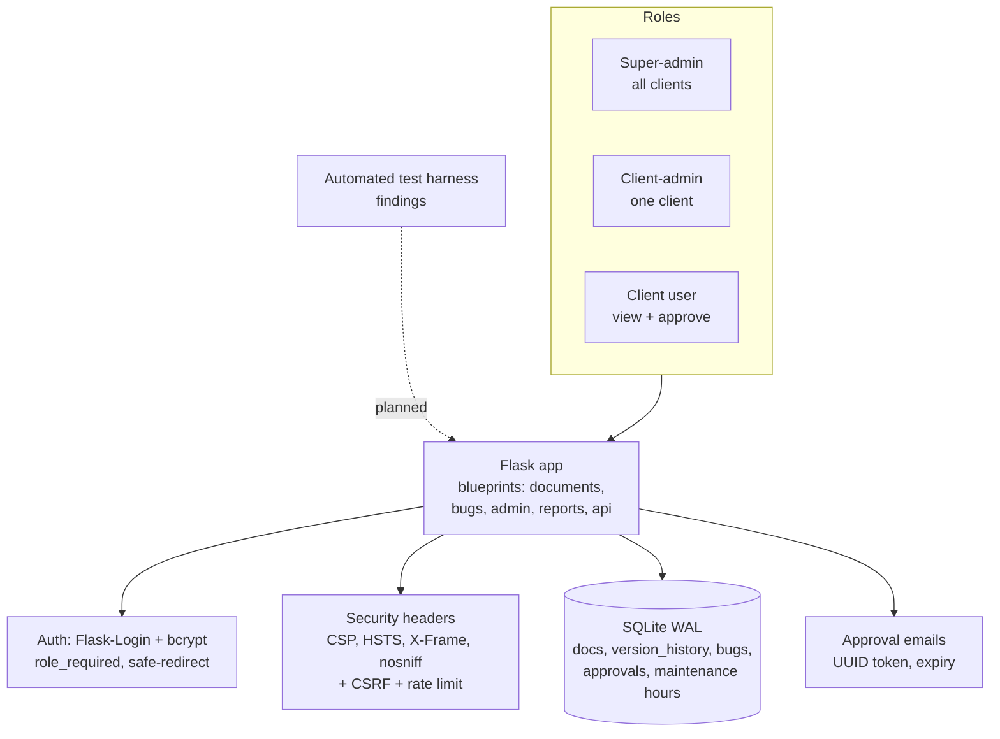

# Document Version & Findings Tracker — Case Study

*A multi-tenant Flask web app for controlled-document version history, change audit, and a
client-facing defect/findings workflow with sign-off — built security-first (RLS-style scoping,
bcrypt, CSRF, rate limiting, CSP) and designed to also ingest findings from an automated test
harness.*

> Source is private. This write-up covers architecture and engineering decisions, not the
> implementation. Source available on request under NDA or via a live walkthrough.

---

## Problem & context
Teams that maintain controlled documents (procedures, course materials, specs) need more than a file
share: every revision needs a who/when/why audit trail, documents need review-due tracking, and when
defects are found they need a tracked workflow — ideally one where the *client* can review and sign
off, with the maintenance time tracked against pre-purchased hours for billing.

The goal was a single app that handles document version history *and* a findings/defect tracker with
a client approval workflow and maintenance-hour accounting — multi-tenant, so one deployment serves
multiple clients with strict data separation.

## My role & scope
Sole architect and engineer — the data model, the role-based multi-tenant access control, the
approval and billing workflows, the security hardening, and the deployment.

## Architecture

**Data flow:** authenticated users act within their role and client scope; document edits write an
immutable version-history row; findings move through a workflow that can require a tokened client
approval; and maintenance time is logged against pre-purchased hour packages for billing.

## AI / ML approach
No model in the app itself — but it was **designed as a sink for AI-generated findings**: an
automated test harness can post structured findings into the tracker's schema. *Honest status:* the
harness-facing ingest endpoint is part of the design, not yet implemented; today findings are entered
through the UI. The schema (severity/priority/type, environment, repro steps, source document) is
already shaped to accept machine-generated findings.

## Key decisions & tradeoffs
- **Multi-tenancy via role-scoped queries.** A super-admin sees all clients; a client-admin and
  client users are scoped to a single `client_id` at the query layer, with soft-deletes preserving
  the audit trail. One deployment, strict separation — cheaper and simpler than per-client instances.
- **Append-only version history.** Document revisions are never overwritten; each change writes a new
  `version_history` row (revision, status, who, when, reason, comment). The audit trail is the
  feature, so it's immutable by construction.
- **Tokened client approval, no account required to sign off.** Findings that need client sign-off
  generate a UUID approval token with an expiry and an email link, so a client can approve without an
  interactive admin step — secure (unguessable, time-bounded) and low-friction.
- **Billing built into the workflow.** Maintenance-hour packages, per-finding time entries, and
  billable classifications (included / deduct / billable / change-order / warranty) live alongside
  the findings, with a client-visibility flag so confidential time stays internal.
- **Security as a first-class requirement, not a checklist.** Given it holds client data and an
  approval workflow, the app ships bcrypt password hashing, CSRF on every form, login rate limiting,
  a strict CSP, HSTS/X-Frame/nosniff headers, safe-redirect checks, and validated file uploads from
  day one.

## Security & data handling
- **Authn/Authz:** bcrypt-hashed passwords via Flask-Login; a `role_required` decorator and
  client-scoped queries enforce least privilege; post-login redirects are validated against an
  open-redirect guard.
- **Web hardening:** Flask-WTF CSRF on all forms, Flask-Limiter rate limiting on login, a
  Content-Security-Policy plus HSTS / X-Frame-Options: DENY / X-Content-Type-Options headers, and
  secure/HttpOnly/SameSite cookies.
- **Secret management:** all secrets (Flask secret key, SMTP) load from environment variables with a
  `.env.example`; nothing hardcoded. The initial admin password is generated randomly at first DB
  init, printed once, and never stored — no default credential to leave exposed.
- **Uploads:** secure-filename sanitization, UUID rename, an extension allowlist, and a size cap.

## Performance, cost & reliability
- **SQLite in WAL mode** for concurrent reads during writes — right-sized storage for a multi-tenant
  internal app without standing up a database server.
- **DB triggers** keep `updated_at` accurate without application bookkeeping.
- **Graceful degradation:** if email isn't configured, approval links are shown in the UI instead of
  failing — the workflow still works.
- **Deployment:** documented paths for both cPanel/Passenger and a Lightsail + Nginx + Gunicorn +
  Certbot (HTTPS) stack, with a systemd unit and reverse-proxy config.

## Outcomes
- A security-hardened, multi-tenant document-control and findings app with an immutable audit trail,
  a tokened client approval workflow, and integrated maintenance-hour billing — deployable on
  commodity hosting with HTTPS.
- A schema and design already shaped to ingest findings from an automated test harness, positioning
  it as the system-of-record half of a larger quality pipeline.

*(Internal product; production-intent with a complete deployment guide. The harness-ingest endpoint
is designed but not yet implemented — stated plainly rather than implied.)*

## What I'd do next
- Implement and authenticate the findings-ingest API so an automated test harness can post directly.
- Add per-client audit exports and a dashboard of review-due documents.
- Move from SQLite to Postgres if a single deployment outgrows WAL-mode concurrency.

---
*Architecture and decisions shown here; source is private. Available for a live walkthrough or under
NDA.*
