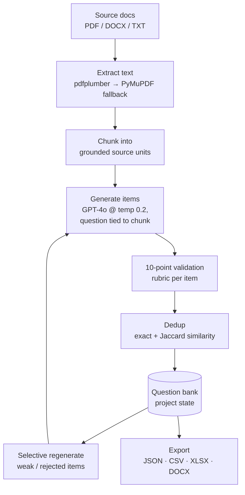

# Grounded Exam-Question Generator — Case Study

*A desktop application that generates multiple-choice question banks from source documents, where
every question is grounded in a specific source excerpt, validated against a 10-point rubric, and
de-duplicated — built so the output can survive a compliance review.*

> Source is private. This write-up covers architecture and engineering decisions, not the
> implementation. Source available on request under NDA or via a live walkthrough.

---

## Problem & context
Writing exam questions for licensing or certification courses is slow expert work, and the failure
mode is expensive: a question that isn't actually supported by the course material, or that's subtly
wrong, can invalidate an assessment. Generic "ask an LLM for 20 questions" tools fail exactly here —
they produce fluent questions that aren't traceable to the source and quietly duplicate each other.

The goal was a tool a non-engineer can run on a folder of source PDFs and get a question bank where
**every item is tied to a source excerpt**, weak items are caught before export, and the whole
project can be saved, reopened, and selectively regenerated.

## My role & scope
Sole architect and engineer. I designed the grounding and validation pipeline, the deduplication
strategy, the desktop UX, and the export/persistence layer.

## Architecture

**Data flow:** documents are extracted and chunked, each chunk drives generation of grounded items,
every item passes a validation rubric and a two-stage dedup, and survivors land in a persistent
project the user can reopen and selectively regenerate before exporting in four formats.

## AI / ML approach
- **Grounding is the product.** Generation runs at low temperature (0.2) and each question is
  produced against a specific source chunk with its excerpt retained, so a reviewer can see *why*
  each question is valid. The model is constrained to the source rather than its open-domain memory.
- **Model tiering.** A stronger model (GPT-4o) does primary generation; a cheaper model
  (gpt-4o-mini) backs the fallback path, so the tool degrades gracefully and controls cost.
- **Validation as a guardrail, not a vibe check.** Every generated item is scored against an
  explicit 10-point rubric (answer correctness, single defensible key, plausible distractors,
  grounding in source, etc.). Items that fail are flagged for regeneration rather than shipped.
- **Failure modes handled explicitly.** Exact-match and Jaccard-similarity dedup remove the
  near-duplicate questions LLMs love to emit; the user can regenerate only the rejected slots
  instead of re-running the whole bank.

## Key decisions & tradeoffs
- **Desktop app, not a notebook or web service.** The user is a subject-matter expert, not an
  engineer. A PySide6 desktop app with an API-key entry screen means no server to run, no secrets in
  source, and the data never leaves the machine — which matters for unreleased exam content.
- **Project persistence over fire-and-forget.** Question authoring is iterative. Saving full project
  state (sources, items, validation results, decisions) lets the user close the app and come back,
  and makes selective regeneration possible.
- **Four export formats.** JSON/CSV for downstream pipelines, XLSX/DOCX for the humans who actually
  review and approve the bank. Meeting reviewers where they are mattered more than format purity.
- **Runtime key entry, nothing stored in source.** The OpenAI key is entered at runtime, so the repo
  carries no credential.

## Security & data handling
- The API key is supplied at runtime through the UI; it is not hardcoded and not committed.
- Source documents and generated banks stay local to the user's machine — appropriate for
  pre-release assessment material.
- Parsing is defensive: a primary PDF extractor with a fallback engine, so malformed or image-heavy
  documents fail into a fallback path rather than producing silent garbage.

## Performance, cost & reliability
- **Low-temperature generation + validation gating** keeps regenerations targeted — you re-spend
  tokens only on the items that failed, not the whole bank.
- **Two-stage dedup** (cheap exact match before the similarity pass) avoids paying for redundant
  questions and keeps the bank tight.
- **Model fallback** keeps the tool working through rate limits or transient errors on the primary
  model.

## Outcomes
- A production-grade desktop tool that turns a folder of source material into a reviewable,
  de-duplicated question bank with per-item grounding and validation — the properties that make
  generated assessment content trustworthy rather than just plausible.
- Clean separation of generate → validate → dedup → export, so each stage is independently
  inspectable.

*(Personal project; figures here describe the build and its design, not a published deployment.)*

## What I'd do next
- Add an offline eval set that scores the generator's grounding and distractor quality across runs,
  so prompt changes can be measured rather than eyeballed.
- Support more item types (scenario-based, multi-select) with type-specific validation rubrics.
- Batch generation with concurrency under the provider's rate limit for large source sets.

---
*Architecture and decisions shown here; source is private. Available for a live walkthrough or under
NDA.*
