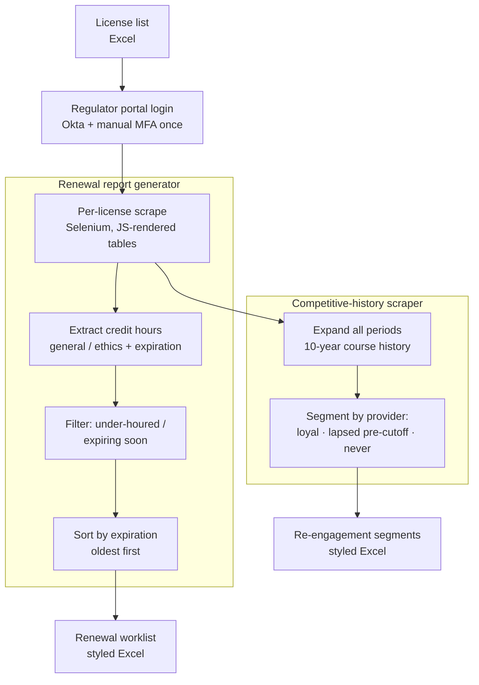

# Regulatory-Data Intelligence for Renewals — Case Study

*Two Selenium tools that turn a licensing regulator's continuing-education portal into sales
intelligence: a renewal-report generator that finds clients with expiring credit requirements, and a
competitive-history scraper that segments the full market by where they've been taking courses — both
feeding a re-engagement motion.*

> Source is private. This write-up covers architecture and engineering decisions, not the
> implementation. Source available on request under NDA or via a live walkthrough.

---

## Problem & context
A continuing-education provider's growth depends on two questions it can't answer from its own
database: *which licensed professionals are about to fall out of compliance* (and therefore need to
buy courses now), and *where are they taking those courses* — with us, with a competitor, or not at
all. Both answers live in a public-but-MFA-gated regulator portal, one license at a time, behind a
JavaScript UI. Pulling that by hand across thousands of licenses is impossible to keep current.

The goal was to extract that regulatory data reliably and turn it into two actionable outputs: a
**renewal report** (who's expiring / under-houred, sorted by urgency) and a **competitive
segmentation** (who's loyal, who's lapsed, who's never bought) to target re-engagement.

## My role & scope
Sole engineer — both Selenium tools, the portal session/MFA handling, the parsing and segmentation
logic, and the styled report output.

## Architecture

**Data flow:** a list of licenses drives an authenticated, MFA-cleared session; for each license the
tools either extract current credit-hour status (renewal generator) or expand and parse the full
multi-year course history (competitive scraper), then emit a sorted/segmented, styled spreadsheet
the sales team can act on.

## AI / ML approach
None — this is robust web automation and data engineering against a JavaScript-rendered,
MFA-protected target. The value is in correct extraction and the segmentation logic, not a model.

## Key decisions & tradeoffs
- **Respect the MFA; automate around it.** The portal uses Okta MFA, so the tools log in and pause
  for the operator to clear MFA once, then run the whole batch in that session — automating the
  tedious part (thousands of lookups) without trying to defeat the security control.
- **Drive the JavaScript UI, don't fake the API.** Transcript tables render client-side and hide
  historical periods behind expanders; the scraper clicks through to expand every compliance period
  and reads the settled DOM, because the rendered table is the source of truth.
- **Resilient per-license extraction.** License-type codes vary, so the scraper tries known types in
  order until a page renders, validates rows against a date pattern, and deduplicates courses on a
  stable course id — so one malformed license doesn't poison the run.
- **Segment by a meaningful cutoff, not just "customer y/n".** The competitive tool's three buckets —
  currently active with us, *lapsed* (bought before a cutoff but not since), and never — map directly
  to different re-engagement plays, which is what makes the output a sales tool rather than a data
  dump.
- **Intermediate saves on long runs.** Batches of thousands of licenses checkpoint periodically, so a
  mid-run failure doesn't lose hours of scraping.

## Security & data handling
- **Credentials externalized:** the portal login that was stored in a plaintext creds file / hardcoded
  as dialog defaults was replaced with placeholders + `.gitignore` and the credentials rotated, as
  part of a portfolio secrets audit. The license/PII spreadsheets stay local and are git-ignored.
- **PII discipline:** outputs contain licensee data used internally for outreach; they live on the
  operator's machine, never in source control.
- **Anti-automation-detection** flags are set only to keep a legitimate, authenticated session
  stable, not to evade access controls — the operator is logged in as themselves.

## Performance, cost & reliability
- **Session-amortized MFA:** one interactive login covers an entire batch — the expensive step paid
  once.
- **Checkpointing + dedup** keep long runs recoverable and the output clean.
- **Explicit waits** for the JS framework to settle (rather than fixed sleeps where possible) reduce
  both flakiness and wasted time.

## Outcomes
- Two working tools that convert a one-license-at-a-time regulatory portal into bulk sales
  intelligence: a renewal worklist sorted by urgency, and a market segmentation that distinguishes
  loyal, lapsed, and never-customer licensees for targeted re-engagement.
- The lapsed/never segmentation directly feeds the re-engagement side of the
  [sales-growth platform](./sales-commission-platform.md) — this is where "who should we contact this
  month" comes from.

*(Internal tools for a course business; in production use. Figures describe the build and its design,
not published campaign results.)*

## What I'd do next
- Schedule the renewal generator to run continuously and push expiring-soon licensees straight into
  the outreach queue.
- Replace screen-driven scraping with the portal's underlying data calls where terms permit, for
  speed and resilience.
- Add change-detection so each run reports *new* lapses since the last run, not the full set.

---
*Architecture and decisions shown here; source is private. Available for a live walkthrough or under
NDA.*
