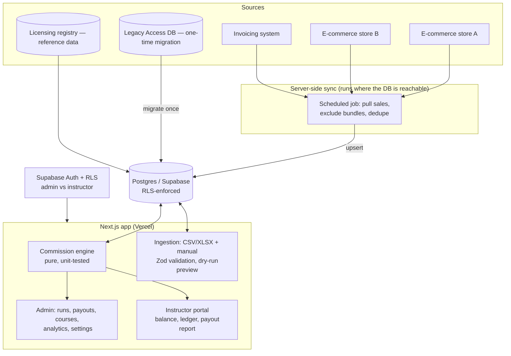

# Sales-Growth & Commission Platform — Case Study

*A production web platform that consolidates multi-source sales, computes instructor
commissions to-the-cent against a legacy system, and runs the monthly payout + marketing loop.*

> Source is private (proprietary product). This write-up covers architecture and engineering
> decisions, not implementation or the commercial strategy. Source available on request under
> NDA or via a live walkthrough.

---

## Problem & context
A continuing-education / professional-licensing company ran its monthly business on a sprawling
Microsoft Access database plus hand-built Excel macros: sales were exported from two e-commerce
stores, de-duplicated and cleaned by hand, instructor commissions were computed with a fragile
query, and payouts were tracked in a spreadsheet ledger. The process was slow, error-prone, and
impossible to give instructors visibility into.

The goal: replace it with a real web platform that (a) consolidates sales automatically, (b)
computes commissions **identically to the trusted legacy numbers**, (c) gives each instructor a
self-service portal, and (d) turns the data into a monthly growth loop (trends → targeted
re-engagement → attribution).

## My role & scope
Sole architect and engineer — end to end: data archaeology of the legacy Access/PHP system,
schema + RLS design, the commission engine, the ingestion pipeline, the admin panel and
instructor portal, the integrations, deployment, and the reconciliation that proved correctness.

## Architecture

**Data flow:** sources → a server-side sync (or validated upload) → a single Postgres `orders`
fact table → the commission engine → ledger/payouts and per-instructor reports. Reads are served
from a cached in-memory snapshot of Postgres; all writes go through the service role behind an
explicit admin check, with Row-Level Security as defense-in-depth.

## AI / ML approach (honest scope)
This is a **data-engineering and systems** project, not an LLM application — I'm not going to
claim AI depth it doesn't have. Where intelligence shows up today it's deterministic:
- **Entity resolution** — fuzzy, accent-insensitive matching of sales clients to the licensing
  registry (normalize → match on national producer number, fall back to name).
- **Anomaly surfacing** — the ingestion/commission paths flag misconfigured records, zero-paid
  lines, and unmapped products for human review rather than silently dropping or trusting them.
- **Designed-for-AI seams** — the "growth loop" (rank monthly marketing plays by expected lift;
  personalize renewal outreach) is the natural place to add an LLM later; the schema captures the
  campaign/attribution data that would train/feed it. Today that layer is rules-based.

If the target role is specifically *applied LLM* engineering, this is better positioned as a
**solutions-architecture / data-platform** case study, with a separate project for LLM depth.

## Key decisions & tradeoffs
- **Reconcile to the cent before building UI.** The first deliverable was the commission engine
  as a pure, unit-tested module validated against the legacy system's own output for a full
  month — per-instructor and grand total. Trust in the numbers was the whole project; everything
  else built on a verified core.
- **One fact table, computed views.** Rather than mirror the legacy schema, sales land in a
  single normalized `orders` table; commissions, balances, analytics, and reports are all derived
  from it. Credits net out as rows (never deletions) for a full audit trail.
- **Configurable formula, captured per run.** The commission math (a platform retention factor, a
  per-credit-hour deduction, and a per-course rate that can be split across multiple instructors)
  is admin-configurable, so historical periods reconcile against the values in effect then.
- **Repository seam over a hard Supabase coupling.** The app talks to a small data-access layer
  with a Postgres adapter for production and a seed adapter for tests/local — so the full suite
  runs with no network and the storage backend is swappable.
- **Met the network reality instead of fighting it.** The production database is only reachable
  from inside the host (private IP, proxied domain). Rather than weaken security to reach it
  externally, the recurring sync runs **on the server** and pushes out to Postgres — same trust
  boundary as the legacy tooling, zero new exposure.

## Security & data handling
- **Secrets**: none in source or git history (audited across all commits); all via env vars,
  validated at startup; `.env*` and all data files git-ignored; `.env.example` with placeholders.
- **Authz**: Supabase Auth with role separation; **RLS on every money table**; an IDOR guard so an
  instructor can only ever load their own account (verified: cross-account access redirects).
- **Input safety**: every imported/entered row is schema-validated (Zod), parameterized writes
  only, spreadsheet formula-injection neutralized, idempotent dedup keys, and a **dry-run preview**
  before any commit.
- **PII**: a 15k+ record licensing registry and client contact data live only in the database and
  are never committed; the platform sends no email (no outbound PII by design).

## Performance, cost & reliability
- **Caching**: a short-TTL in-memory snapshot of Postgres avoids re-querying ~12k rows per request;
  paginated loads pull the full dataset past the API's row cap.
- **Idempotency**: every sync/import upserts on a natural key and merges duplicate line items, so
  re-runs (hourly cron, re-uploaded files) never double-count.
- **Reliability**: the legacy report double-counted bundle ("paquete") sales; the new pipeline
  excludes the bundle parent line and tracks bundles in a separate table — which made month
  revenue reconcile to the source system **exactly**.
- **Tests/gates**: ~60 automated tests (engine, ledger, ingestion safety, and a to-the-cent
  reconciliation against legacy data) plus type-check and production-build gates on every change.

## Outcomes
- Commission engine **reconciles to the legacy system to the cent** for a full month (per
  instructor + total) — the acceptance bar that mattered.
- Replaced a manual Access+Excel process with an automated pipeline: legacy data migrated
  (~12.5k transactions, ~600 courses, ~15.6k license records), monthly sync now runs unattended.
- Caught and fixed a real revenue-overstatement bug (bundle double-counting) so reported revenue
  matches the e-commerce source exactly.
- Instructors get self-service balances and printable payout reports; admins go from raw monthly
  data to a finalized payout list in one flow.

*(Numbers above are from this build and its reconciliation tests; broader business-impact metrics
are pending a full production cycle.)*

## What I'd do next
- Wire the integrations to live APIs/credentials and add Sentry + uptime monitoring before GA.
- Build the LLM-backed "opportunity engine" (rank monthly plays by expected lift) and
  personalized renewal drafting on top of the campaign/attribution schema already in place.
- Add an evaluation harness for that AI layer (offline scoring of suggestions vs. realized sales).

---
*Architecture and decisions shown here; source and the commercial strategy are private. Available
for a live walkthrough or under NDA.*
