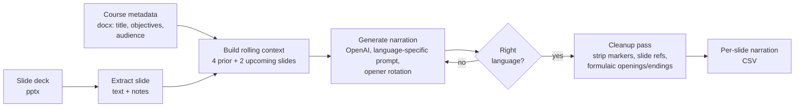

# Slide Narration Generator — Case Study

*A tool that reads a slide deck plus its course metadata and writes flowing, instructor-voice
narration for every slide — with a rolling context window for continuity and a cleanup pass that
strips the tells of machine-written text.*

> Source is private. This write-up covers architecture and engineering decisions, not the
> implementation. Source available on request under NDA or via a live walkthrough.

---

## Problem & context
Narrating a course deck by hand is hours of repetitive writing, and naive automation reads like it:
each slide narrated in isolation produces choppy, disconnected text that restarts the topic every
slide and leans on the same formulaic openings ("In this slide, we will…"). For multilingual courses
it also silently drifts into the wrong language.

The goal was narration that sounds like one instructor talking continuously through a deck — aware of
what came before and what's coming next — generated in the target language, with the obvious
LLM-isms removed.

## My role & scope
Sole engineer. I designed the context-window strategy, the language handling, the prompt design, and
the multi-stage cleanup that makes the output usable without hand-editing.

## Architecture

**Data flow:** slide text and course metadata feed a rolling context window; each slide is narrated
with awareness of its neighbours, verified to be in the requested language (regenerated if not),
cleaned of machine-writing tells, and written out as per-slide narration ready for the
[TTS pipeline](./tts-audio-production-pipeline.md).

## AI / ML approach
- **Continuity via a bidirectional context window.** Each slide is narrated with the previous four
  and next two slides in context, so narration references back and sets up forward instead of
  restarting every slide. This was the single biggest quality lever.
- **Language-specific prompts + a verification gate.** Separate system prompts per language and an
  explicit post-generation language check (regenerate on mismatch) stop the silent
  drift-into-English failure that breaks multilingual courses.
- **Anti-repetition controls.** Presence/frequency penalties plus a rotating pool of sentence
  openers (tracking recently used ones) keep the narration from sounding templated.
- **Cleanup as a guardrail.** A multi-stage regex pass removes the residue of machine writing —
  internal markers, "Slide 3"/"Page 2" references, and formulaic "Let me explain…/In summary…"
  bookends — so the output reads like a person wrote it.

## Key decisions & tradeoffs
- **Bounded context, not the whole deck.** Feeding the entire deck per slide would cost more and blur
  focus; a tight 4-back/2-forward window captured almost all the continuity benefit at a fraction of
  the tokens.
- **Verify language, don't assume it.** Trusting the model to "just write Spanish" failed often
  enough that an explicit check-and-regenerate loop was worth the extra call.
- **Cap creativity where it hurts.** Temperature is capped so narration stays grounded in the slide
  content rather than inventing material — accuracy matters more than flair in instructional text.
- **CSV out, decoupled from audio.** Narration is emitted as data, not audio, so it can be reviewed
  and edited before a separate stage turns it into speech.

## Security & data handling
- The OpenAI key loads from a parameter or the `OPENAI_API_KEY` environment variable — no key in
  source. (A historical hardcoded-key path in a sibling tool was removed as part of a portfolio
  secrets pass.)
- Slide and course content stay local; only slide text is sent to the model.

## Performance, cost & reliability
- **Windowed context** keeps per-slide token cost roughly constant regardless of deck length.
- **Targeted regeneration** (only on language-check failure) avoids blanket re-runs.
- **Dual API path** (newer Responses API with graceful fallback to Chat Completions) keeps the tool
  working across model/SDK changes.

## Outcomes
- Production tool, used to narrate real multi-slide course decks (evidenced by generated narration
  output). Produces continuous, single-voice narration in the target language with the common
  machine-writing tells removed — narration that's reviewable rather than re-writable.

*(Personal/internal tool; figures describe the build and its design, not a published deployment.)*

## What I'd do next
- Pronunciation/terminology hints so domain terms narrate consistently across a deck.
- A reviewer diff view (generated vs. edited) to capture human edits as future prompt guidance.
- Tighter coupling to the TTS stage so narration and audio regenerate together per slide.

---
*Architecture and decisions shown here; source is private. Available for a live walkthrough or under
NDA.*
