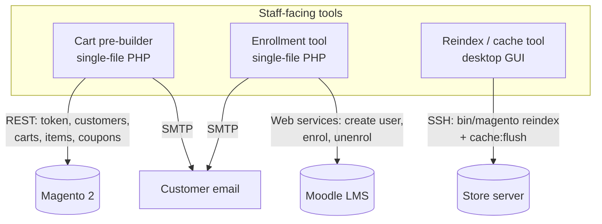

# Store & LMS Operations Toolkit — Case Study

*A set of internal staff tools that integrate an e-commerce store (Magento 2) and a learning platform
(Moodle) over their REST/web-service APIs: pre-building customer carts, provisioning and enrolling
students, and safely running store reindex/cache operations over SSH — each with its own auth model.*

> Source is private. This write-up covers architecture and engineering decisions, not the
> implementation. Source available on request under NDA or via a live walkthrough.

---

## Problem & context
Running an online course store generates a steady stream of staff operations that don't fit the
customer-facing storefront: a rep needs to assemble a cart of courses for a customer and email them a
checkout link; a new student needs an account and enrollment in several courses with credentials
emailed; and after catalog changes someone has to reindex Magento and flush its cache on the server —
a task you do *not* want to hand a non-technical staffer raw SSH access to do.

The goal was small, single-purpose tools that let trusted staff perform these operations safely,
through the platforms' own APIs, without touching the database directly or sharing server
credentials.

## My role & scope
Sole engineer. I built three tools against the Magento 2 REST API, the Moodle web-service API, and
SSH respectively, each with an auth and credential model fitted to how it's used.

## Architecture

**Data flow:** each tool authenticates a staff operator, calls the target platform's API (Magento
REST, Moodle web services, or SSH commands), and reports a per-item result — applying coupons,
emailing credentials, or streaming reindex output as appropriate.

## What each tool does
- **Cart pre-builder (Magento REST):** staff search the catalog, assemble a cart under a new or
  existing customer account (creating the account and a temporary password if needed), apply an
  optional coupon, and email the customer a templated checkout link. Reusable product *bundles* are
  saved as JSON so common course packages load in one click. Respects special-price windows when
  pricing items.
- **Enrollment tool (Moodle web services):** look up or create a student, derive a collision-safe
  username, enroll/unenroll across multiple courses in one action, optionally reset a password, and
  email credentials with the enrolled-course list from a customizable template.
- **Reindex/cache tool (SSH):** a desktop app that runs Magento's `indexer:reindex` and
  `cache:flush` over SSH with a memory limit, streaming output and a progress bar — built so a
  non-admin can run it without ever seeing the server credentials.

## AI / ML approach
None — this is integration and operations engineering. Included in the portfolio precisely because
not every problem is an LLM problem; knowing when *not* to add a model is part of the job.

## Key decisions & tradeoffs
- **API-first, never the database.** Every operation goes through Magento's REST API or Moodle's web
  services rather than raw SQL, so the platforms' own validation, indexing, and business rules stay
  intact — the safe way to script a system you don't want to corrupt.
- **An auth model fitted to each tool's blast radius.** The cart and enrollment tools use a shared
  page-password (constant-time compared) for quick staff access; the reindex tool — which holds
  *server* credentials — uses a two-secret model where an admin configures encrypted credentials and
  staff run operations with only a PIN, so operators can reindex without holding SSH access.
- **Encrypted-at-rest server credentials.** The reindex tool stores SSH credentials as Fernet-
  encrypted blobs keyed off the admin password and the operator PIN separately — neither plaintext on
  disk nor recoverable with the PIN alone.
- **Single-file, runtime-configurable PHP for the web tools.** The cart and enrollment tools deploy
  as one file with settings overridable via a runtime JSON config, so they drop onto the host with no
  build step — pragmatic for internal tooling.
- **Templated, per-item-resilient operations.** Emails are templatable; a failure on one course or
  one cart item is reported as a warning and the rest of the batch continues, rather than aborting.

## Security & data handling
- **Server credentials are never exposed to operators** — the reindex tool's PIN model and encrypted
  credential blobs are the whole point.
- Page passwords are compared with constant-time comparison; new-account passwords are randomly
  generated.
- **Secrets remediation:** the staff PHP tools previously carried hardcoded API/SMTP credentials for
  convenience; these were replaced with placeholders + `.gitignore`d runtime config and the
  credentials rotated as part of a portfolio-wide secrets audit. The tools already supported runtime
  config override, so removing the hardcoded values cost nothing operationally.
- All customer/student PII flows through the platform APIs and email — none is stored by the tools
  beyond transient request state.

## Performance, cost & reliability
- **Idempotency where it matters:** username collision handling, special-price-window-aware pricing,
  and per-item error reporting keep operations predictable.
- **Bounded server operations:** reindex/cache commands run with an explicit memory limit and
  timeouts so a heavy reindex can't take the host down.

## Outcomes
- Three production/near-production staff tools that turn error-prone manual store and LMS chores into
  guided, API-safe operations — including letting non-admins run server maintenance without server
  credentials.
- A concrete demonstration of integration engineering across two third-party platforms and SSH, with
  a credential model designed around least privilege.

*(Internal tooling for a course business; the cart and reindex tools are in production use, the
enrollment tool is a deployable exemplar. Figures describe the build, not published metrics.)*

## What I'd do next
- Replace the shared page-password on the web tools with per-staff accounts and an audit log of who
  did what.
- A small queue/worker for bulk enrollment so large cohorts process with retries and backpressure.
- Webhook the cart tool into the storefront so abandoned pre-built carts trigger follow-up.

---
*Architecture and decisions shown here; source is private. Available for a live walkthrough or under
NDA.*
