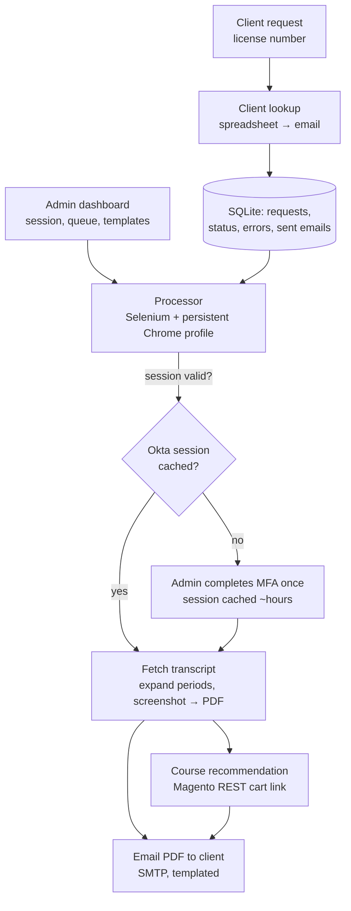

# Continuing-Education Transcript Automation — Case Study

*A deployed Flask service that automates retrieval of professional continuing-education transcripts
from a regulator's MFA-protected portal, delivers them to clients as PDFs by email, and recommends
follow-up courses — turning a manual, login-gated lookup into an admin-driven queue.*

> Source is private. This write-up covers architecture and engineering decisions, not the
> implementation. Source available on request under NDA or via a live walkthrough.

---

## Problem & context
Licensed professionals (e.g. insurance agents) periodically need an official transcript of their
continuing-education credits, which lives behind a regulator's portal protected by Okta multi-factor
authentication. Pulling each one by hand — log in, clear MFA, find the license, expand historical
periods, screenshot, PDF, email — is slow and doesn't scale past a handful, and the portal's MFA
makes naive "just automate it" approaches fall over.

The goal was a service that lets staff fulfill transcript requests from a queue: handle the regulator
login and MFA *once* per session, fetch and PDF the transcript, email it to the client, and surface a
relevant follow-up course to renew the relationship.

## My role & scope
Sole architect and engineer — the Flask service, the Selenium automation and session/MFA strategy,
the SQLite data model and request queue, the email/PDF delivery, the course-recommendation
integration with the store, and the Docker/Render deployment.

## Architecture

**Data flow:** a license number is matched to a client, a request row is created, and the admin
drives the queue; the processor reuses a cached regulator session (or prompts the admin through MFA
once), fetches and PDFs the transcript, emails it, and builds a follow-up course recommendation via
the store's API.

## AI / ML approach
None — this is browser-automation and systems engineering against a hostile (MFA-gated, JavaScript-
rendered) target. The "intelligence" is in the session/queue design, not a model. Course
recommendation is rule-based (remaining credit hours → matching courses).

## Key decisions & tradeoffs
- **Solve MFA with session reuse, not by defeating it.** A persistent Chrome profile caches the Okta
  session after the admin clears MFA once; subsequent requests in that window run without re-auth.
  This respects the regulator's security model instead of trying to bypass it — the only honest way
  to automate an MFA portal.
- **Queue instead of fail when the session is down.** Rather than erroring when no valid session
  exists, requests queue and an alert emails the admin to authenticate — so transient session expiry
  becomes a delay, not a lost request.
- **Single-worker by necessity.** Selenium browser state can't be shared across workers, so the
  service runs one Gunicorn worker. I treated that as a known constraint and designed the queue
  around it rather than pretending it scales horizontally.
- **Screenshot-to-PDF over DOM parsing.** The portal renders transcripts via a JavaScript framework;
  capturing the rendered page and converting to PDF was more robust than scraping a brittle,
  shifting DOM into a reconstructed document.
- **Admin dashboard as the control surface.** Session status, the request queue, sent-email audit,
  error log, and editable email templates all live in one admin view, so the human operator has
  visibility into a process that's inherently semi-attended.

## Security & data handling
- **Secrets externalized.** Regulator/SMTP/store credentials and the admin password moved out of the
  committed config into placeholders + runtime config, `.gitignore`d, with keys rotated, as part of a
  portfolio secrets audit. Session caches, the SQLite DB, transcripts, and Chrome profile are all
  git-ignored.
- **PII handling.** Client contact data comes from a spreadsheet that stays on the host; generated
  transcripts are written to a disk path, emailed, and not committed. No client data lives in source.
- **Auditability.** Sent emails and errors are logged to the database with retention, so every
  delivery is traceable.

## Performance, cost & reliability
- **Session caching** turns the expensive step (interactive MFA login) into a once-per-window cost
  amortized across many requests.
- **Idempotent request states** (pending / queued / completed / failed) make re-runs safe and let the
  queue resume after an interruption.
- **Persistent-disk deployment** (Docker on a managed host with a mounted data volume) keeps config,
  the database, session marker, and transcripts durable across restarts.

## Outcomes
- A deployed service (containerized, running on a managed host with persistent storage) that
  converts a manual, MFA-gated transcript lookup into an admin-driven, queued, audited fulfillment
  flow with automatic PDF email delivery and a follow-up course recommendation.
- An honest engineering story about automating a system you don't control: respect the MFA, design
  around the single-worker constraint, and make the semi-attended parts visible to an operator.

*(Internal product for a course business; production-deployed. Figures describe the build and its
deployment, not published throughput metrics.)*

## What I'd do next
- Move MFA confirmation off the desktop popup to a web-based admin action so the service can run fully
  headless on the server.
- Add retry/backoff and structured monitoring (Sentry + uptime) around the brittle Selenium steps.
- Cache transcript results briefly to avoid re-fetching the same license within a short window.

---
*Architecture and decisions shown here; source is private. Available for a live walkthrough or under
NDA.*
