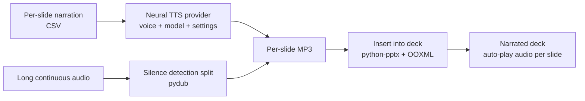

# TTS Audio Production Pipeline — Case Study

*A pipeline that turns per-slide narration into voiced audio with a neural TTS provider, then splits
and places that audio back into the slide deck — closing the loop from script to a narrated
presentation.*

> Source is private. This write-up covers architecture and engineering decisions, not the
> implementation. Source available on request under NDA or via a live walkthrough.

---

## Problem & context
Once a course deck has narration text, someone still has to voice it and get the audio onto the right
slides — traditionally a manual cycle of recording, editing, and dragging clips into the deck. Doing
it by hand for a 100-slide course is a day of tedium, and re-voicing one slide means redoing the
splice.

The goal was to take per-slide narration and produce a deck where each slide carries its own audio,
generated by a configurable neural voice, with long continuous audio split cleanly on silence when
needed.

## My role & scope
Sole engineer. I built the TTS integration (voice/model selection and tuning), the silence-based
audio splitter, and the PowerPoint audio-insertion layer.

## Architecture

**Data flow:** narration text (from the
[narration generator](./slide-narration-generator.md)) is synthesized per slide; optional long-form
audio is split on detected silence; and each clip is embedded into its slide with playback
configured — producing a self-contained narrated deck.

## AI / ML approach
- **Neural TTS with explicit voice control.** Uses a multilingual neural TTS provider with
  per-project control over voice, model variant, and the stability / similarity / style /
  speaker-boost settings — so a course can be re-voiced consistently rather than ad hoc.
- **Model variant per need.** Higher-quality multilingual models for final output; faster, cheaper
  variants available for drafts — a speed/cost/quality choice exposed to the operator.
- **No generation, so no hallucination surface.** This stage only voices text it's given; the
  correctness guarantees live upstream in narration. Keeping synthesis "dumb" is deliberate.

## Key decisions & tradeoffs
- **Silence-based splitting over fixed-length cuts.** Splitting long audio on detected silence
  (tunable threshold and minimum gap) keeps sentences intact, which fixed-duration slicing can't.
- **Embed audio in the deck, don't ship a folder of clips.** Writing audio into the slide via
  `python-pptx` and direct OOXML manipulation (with auto-play configured) means the deliverable is a
  single playable deck, not a deck plus a pile of MP3s the user has to wire up.
- **Two front-ends, one engine.** A GUI for interactive use (voice testing, config persistence,
  connection check) and a headless/batch path for processing a whole course — same synthesis core,
  different ergonomics.
- **Rate-limited, resumable batches.** A configurable delay between calls respects provider limits;
  per-slide output files mean a failed run resumes rather than restarts.

## Security & data handling
- TTS API keys load from configuration/environment. **Note:** earlier iterations hardcoded the
  provider key in source and a config JSON; that was identified and remediated in a portfolio-wide
  secrets pass (placeholders + `.gitignore` + key rotation) — a concrete example of the audit
  catching a real leak.
- Narration text and generated audio are processed locally; only narration text is sent to the
  provider.

## Performance, cost & reliability
- **Per-slide output** makes runs idempotent at the slide level — re-voice one slide without
  touching the rest.
- **Configurable inter-request delay** keeps batch runs inside provider rate limits instead of
  tripping them.
- **Model-variant selection** lets drafts run on fast/cheap voices and finals on the
  highest-quality model, controlling spend.

## Outcomes
- A working script-to-narrated-deck pipeline, used on real courses (evidenced by generated audio
  output across multiple course runs). Turns a day of manual voicing-and-splicing into a configurable
  batch, and makes re-voicing a single slide a one-clip operation.
- Surfaced and fixed a real secret-management issue (hardcoded provider key) during portfolio prep.

*(Personal/internal tool; figures describe the build and its design, not a published deployment.)*

## What I'd do next
- Per-slide regeneration driven directly from edited narration, so a text edit re-voices just that
  slide automatically.
- Loudness normalization across clips for consistent playback volume.
- An offline TTS fallback for cost-sensitive drafts.

---
*Architecture and decisions shown here; source is private. Available for a live walkthrough or under
NDA.*
